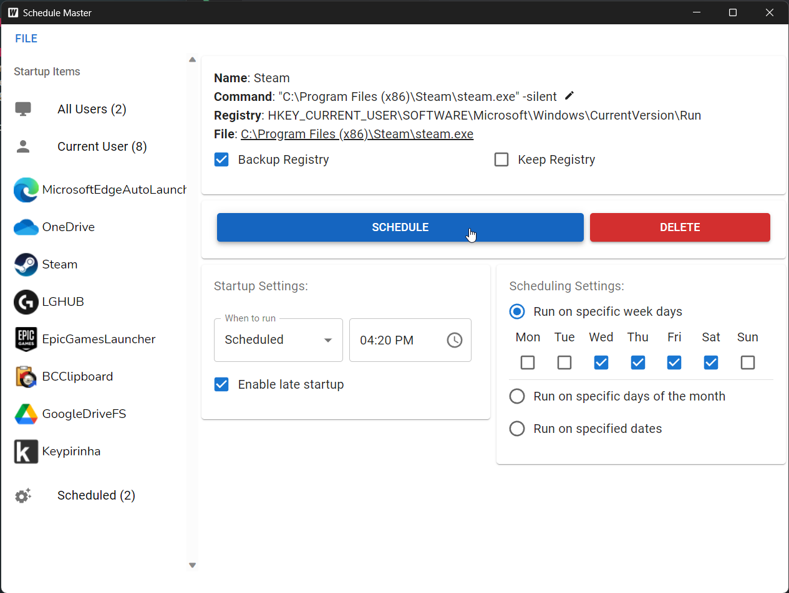

# README

## About

Schedule Master aims to be the to-go tool for scheduling software execution on windows. 
Why? While Windows task scheduler is a good tool, there are several instances where it falls short.

**Upcoming features**: 
&#9744; Installer 
&#9744; Run on startup 
&#9744; Fine-grained complex scheduling 
&#9744; Ensuring a process stays running (& restart it) 
&#9744; Timed shutdown & preventing software from running out of schedule 

If you have any suggestions or have found any bugs, please add a new <a href="https://github.com/Mechanic-Ink/schedule-master/issues">issue</a>.